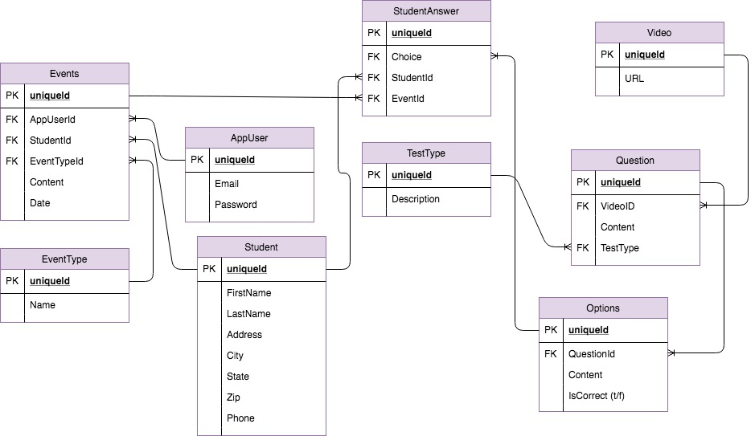

# TaxiPro-FinalCapstone
Built with C# using ASP.NET Core, this app allows users (office administrators) to create and store student profiles which tracks notes about the student as well course results broken down by test. All information is transferred via AJAX HttpRequests.

## Screen Shots
### Register a New User

### or Log in as an Existing User

### View List of Students

### Create New Student

### Edit a Student

### Delete a Student

### Student Profile Detail View

### Test Result Detail View

## Built With

* [Asp.NET](https://www.asp.net/)
* [Bootstrap 3](http://getbootstrap.com/docs/3.3/https://maven.apache.org/)

## License

This project is licensed under the MIT License - see the [LICENSE.md](LICENSE.md) file for details

## Acknowledgments

* This project would not be possible without the help of [Hannah Hall](https://github.com/hannahhall), [Meg Ducharme](https://github.com/megducharme), [Jared Fuller](https://github.com/jaredshane), [Greg Korte](https://github.com/gregkorte), and [Steve Brownlee](https://github.com/stevebrownlee)
* I wouldn't have considered making this project without the inspiration from my wife who works at [TFLI](https://tfli.org/) (Tennessee Foreign Language Institute) who had a problem and took the chance on me to fix it. 
* And finally, Nashville Software School for giving me the tools I need to change the world.

## ERD

